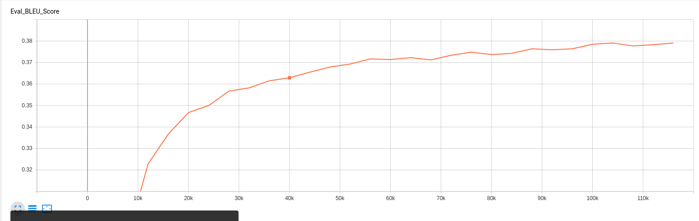
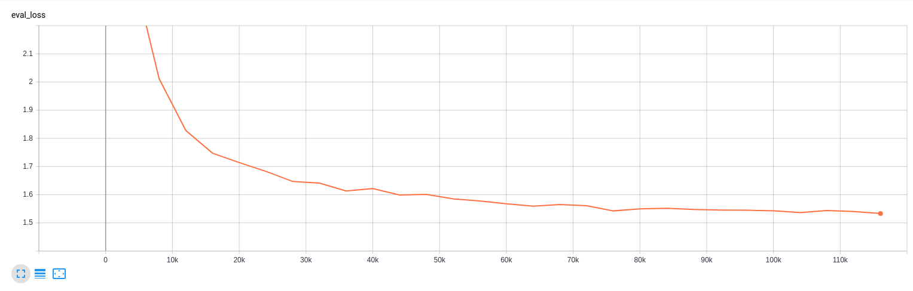
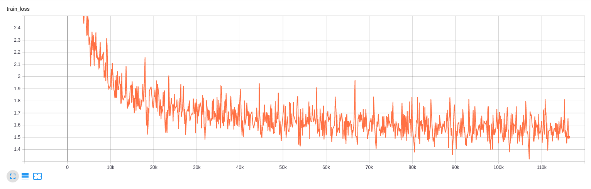
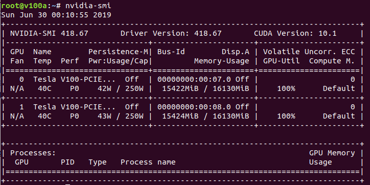
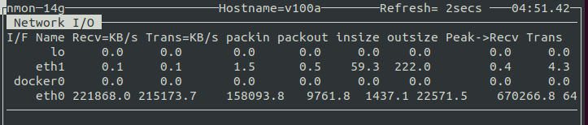
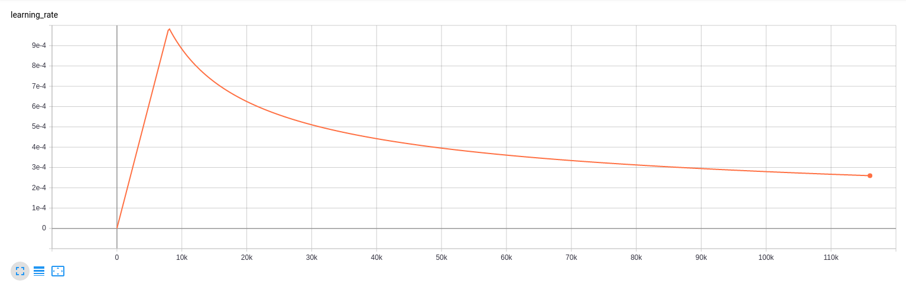
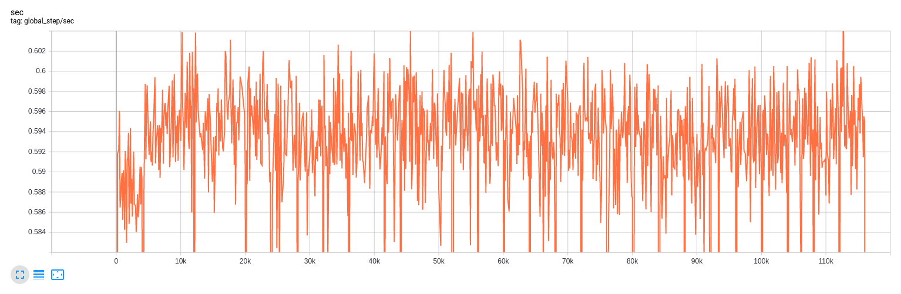

# Homework 9

### 1. How long does it take to complete the training run? 
	
Training takes about 2 days per 100k steps on V100s.  

### 2. Do you think your model is fully trained? How can you tell?

The network is approaching convergence. 


### 3. Were you overfitting?
It does not look like the model is overfitting.  Both eval and training loss are fairly level around 1.6.



### 4. Were your GPUs fully utilized? 
GPUs are working at 100%.


### 5. Did you monitor network traffic (hint: apt install nmon ) ? Was network the bottleneck?

Network I/O is at about 200 MB/s.  This is not a bottleneck since the images have 1000 MB/s connections.


### 6. Take a look at the plot of the learning rate and then check the config file. Can you explan this setting?
The learning rate rises for 8000 steps and then decreases.  
```python
  "lr_policy": transformer_policy,
  "lr_policy_params": {
    "learning_rate": 2.0,
    "warmup_steps": 8000,
    "d_model": d_model,
  }
```


### 7. How big was your training set (mb)? How many training lines did it contain?
The training data is 14GB.

### 8. What are the files that a TF checkpoint is comprised of?
The meta file contains information about the graph.  The data file contains all the values of the variables.  The index file contains checkpoint indexing information.

### 9. How big is your resulting model checkpoint (mb)?
One checkpoint is about 828MB.

### 10. Remember the definition of a "step". How long did an average step take?
Global steps per second hovers just below 0.6.  That means a single step takes about 1.7 seconds.


### 11. How does that correlate with the observed network utilization between nodes?
Network utilization is not limiting the data available to the GPUs.
